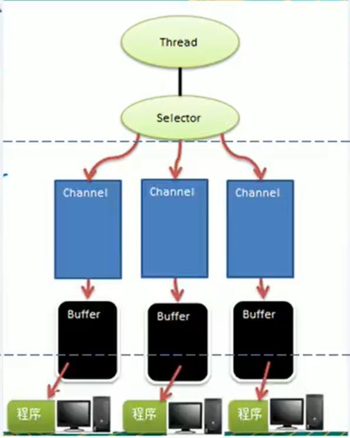

## NIO 基础

### I/O模型

> 1)I/O模型：用什么通道进行数据的传送和接收
>
> 2）JAVA支持3中网络编程模型：BIO、NIO、AIO
>
> 3）JAVA BIO：同步阻塞IO，服务器实现模式为一个连接一个线程。
>
> 
>
> 4）JAVA NIO:同步非阻塞，服务器实现模式为一个线程处理多个请求。
>
> 
>
> 5）JAVA AIO:异步非阻塞，当操作系统完成读取后，才通知服务器启动线程处理。

#### JAVA BIO 

面向Socket进行编程，读取必须等待IO读取完 所以阻塞

> 1)服务端启动ServerSocket
>
> 2）客户端启动socket对服务端进行通信，默认情况下需要对每一个客户建立一个线程与之通信

##### 问题：

> 1) 每个请求需要创建独立的线程。消耗大

#### JAVA NIO

读取无需等待IO读取完 所以非阻塞。同步非阻塞

使一个线程从某个通道发送请求或者读取数据，但它仅能得到目前可用的数据，如果目前没有数据可用就什么也不会获取，而**不是保持线程阻塞**，直到数据变得可读取之前，该线程可以做其他事情。一个线程请求写入一些数据到某通道，不需要等他完全写入，这个线程可去做别的事情。

##### buffer基本操作

```java
 //创建一个buffer 大小5，可存放5个int
        IntBuffer intbuffer=IntBuffer.allocate(5);
        for (int i = 0; i < 5; i++) {
            intbuffer.put(i*2);
        }
        //讲buffer 转换，读写转换(!!!使buffer标志变化)
        intbuffer.flip();

        while (intbuffer.hasRemaining()){
            System.out.println(intbuffer.get());
        }
```

### NIO&BIO

1)BIO是以流的方式来处理数据的，而NIO以块的方式处理数据，块IO的效率比流I/O的高

2）BIO是阻塞的，需要等到I/O读写完，NIO是非阻塞的，无需等待I/O读写完，可立即返回结果。

3）BIO基于字节流和字符流进行操作，而NIO基于channel（通道）和buffer（缓冲区）进行操作，数据总是从通道读取到缓冲区，或者缓冲区写入的通道中，Selector（选择器）用于监听多个通道的事件（请求连接、数据到达）。因此一个线程就可以监听多个客户端连接

### NIO 三大核心原理示意图


Selector、Channel、Buffer的关系

1）每个Channel都会对应一个buffer

2）Selector对应一个线程，一个线程对应多个channel（连接）

3）上图三个channel注册到该selector

4）程序切换到哪个channel是由事件决定的，Event。

5）Selecotr会根据不同的事件，在各个通道上进行切换。

6）Buffer就是一个内存块，底层是由一个组数组成

7）数据的读取写入都是用过buffer进行，和BIO不同，BIO直接向流写入或者输出，BIO的流不能双向，但NIO的buffer是可以双向的，但是需要`flip()`进行切换

8）channel是双向的，跟底层操作系统情况一致。