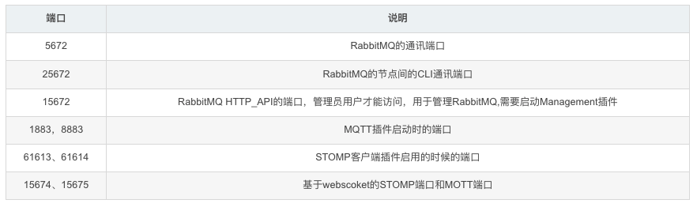
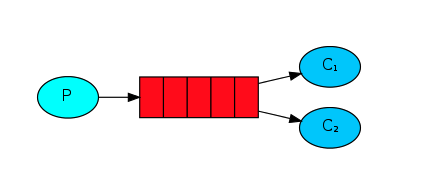
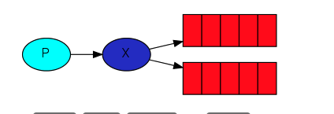
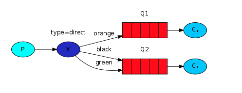
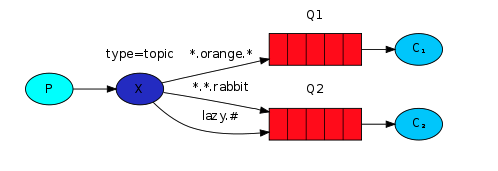
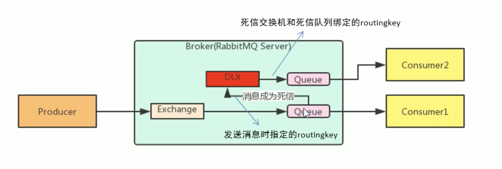

## RabbitMq

[toc]

### MQ的优势

- 应用解耦

- 提高系统吞吐量（单位时间内处理请求的数目）
- 消峰填谷（提高系统的稳定性） 将消息存放到mq中，系统按需来处理维持峰值运行，不会越过最高峰
- 异步处理

### MQ的劣势

- 系统的可用性降低

  > 系统引入的外部依赖越多，系统的稳定性就越差，需要额外保证MQ的高可用

- 系统的复杂度提高

  > 引入MQ之后系统之间的调用由同步的远程调用，转变成MQ的异步调用，需要保证消息没有被重复消费，处理消息丢失，消息传递的顺序性问题。

- 一致性问题

  > ABC系统需要同时完成，加入C系统失败了，那么AB系统的数据需要保证一致性，回滚或者其他操作

### 使用MQ的场景

- 生产者不需要从消费者获取反馈，即调用的远程方法不需要返回值
- 允许短暂的不一致性

### AMQP协议

高级消息队列协议，是一个网络协议，类似于HTTP，基于此协议在客户端和消息中间件中传递消息。

#### AMQP模型的三大组件

- 交换器 (Exchange)：消息代理服务器中用于把消息路由到队列的组件。
- 队列 (Queue)：用来存储消息的数据结构，位于硬盘或内存中。
- 绑定 (Binding)：一套规则，告知交换器消息应该将消息投递给哪个队列。

### JMS

> JMS就是java消息服务应用程序接口，是一个java平台中关于面向消息中间件的API
>
> JMS类似于JDBC就是提供连接MQ实现的

### RabbitMq端口

访问的url

> http://localhost:15672/#/

### RabbitMq 工作模式

> 工作模式的不同主要是 路由设置的不同
>
> 交换机的类型主要有：
>
> - Fanout：广播,发送消息到每一个与之绑定的队列
> - Direct：定向
> - Topic：通配符方式，
> - headers:

#### Work Queues工作队列模式

> 一个生产者 -> 队列 -> 多个消费者
>
> 消息直接发送给消息队列

#### Pub/Sub 订阅模式

> 引入了Exchange 交换机，将消息发送给交换机，通过交换机将消息分发到不同的消息队列中。
>
> 交换机类型：
>
> Fanout：广播,发送消息到每一个与之绑定的队列

#### Rounting 路由工作模式

> 队列与交换机不再是任意得绑定了，而是指定一个RoutingKey（路由key）
>
> 消息在发送的过程中必须指定Exchange（交换机）和RoutingKey（路由key）
>
> Exchange交换机不再把消息分发给每一个与之绑定的队列，而是根据消息的RoutingKey进行判断
>
> 交换机类型 Direct：定向的根据RoutingKey来分发到对应队列

#### Topics 通配符模式

> 交换机类型 Topics
>
> 与路由工作模式原理类似。

### RabbitMQ高级特性

> 消息从生产者发送到路由器再根据路由key 分发到不同的队列再被消费者消费

#### 消息的可靠性

##### 生产者

使用rabbitMq的时候，作为消息的发送发希望杜绝任何消息丢失或者投递失败场景。RabbitMq为我们提供了两种控制消息投递可靠性模式

**confirm** 确认模式

> 消息从生产者到交换机的时候会返回一个confirmCallback
>
> 可以知道消息是否成功的分发到我们的交换机
>
> spring.rabbitmq.publisher-confirm-type=correlated

**return** 退回模式

> 当消息从生产者成功交换到交换机，再从交换机到队列路由失败时才会执行returnCallback 
>
> 可以知道消息是否成功的分发到我们的队列中

##### Consumer ACK 消费者

ack指Acknowledge，确认。表示消费端收到消息后的确认方式。

有三种确认方式：

- 自动确认：acknowledge=”none“   收到消息之后就确认

- 手动确认：acknowledge=”manual“ 等待业务处理无问题再手动代码确认

#### 消费端限流

> 消费MQ消息的时候进行限流 

配置 prefetch属性，消息端一次拉取多少消息

消费端的确认模式必须为手动

#### TTL(存活时间和过期时间)

> 当消息达到存活时间后，还未被消费，会被自动清除
>
> RabbitMQ可以对消息设置过期时间，也可以队伍整个队列设置过期时间

#### 死信队列

> 当消息成为Dead Message后，可以被重新发送到另外一个交换机，这个交换机就是DLX

消息成为死信的情况

- 队列消息达到限制
- 消费者拒绝接受消费信息，
- 队列存在消息过期设置，或者是消息已达到过期时间

（1）声明死信队列、死信交换机

（2）正常的队列绑定死信交换机。设置死信交换机名称和roudingKey

#### 延迟队列

> 即消息进入队列之后不会被立即消费，只有达到指定时间才会被消费

使用TTL和死信队列组合来实现 延迟队列的效果。

#### 日志与监控

##### RabbitMQ日志

RabbitMQ的存储位置 /var/log/rabbitmq/rabbit@xxx.log