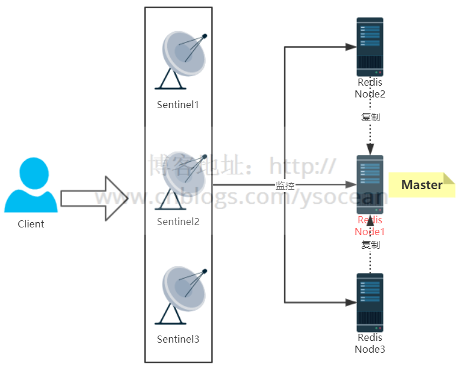

## Redis 高级应用

[toc]

### Redis 主从复制

**何为主从复制？**

正常的测试环境都是单个Redis服务，但是如果项目的访问量变大，那么单个Redis的会出现操作延时的情况，为了解决该问题主从复制就出来咯

**主要实现：一主多从**

一个Master主节点，多个从机Slave节点。

Master主机负责解决写操作，Slave从机只负责读，将读写操作分离

如何实现？？？ bind一下呗

**宕机情况**

主机Master宕机：主机宕机，无法进行写操作，只能从slave从机获取数据，并且如果没有特殊设置，从机还是从机，不会变成主机，而Master主机重启回来的时候继续成为Master主机

从机Slave宕机：无所谓，主要数据还是从Master主机同步的，其中一个Slave从机宕机不影响其他Slave从机

> 那么问题来咯，如果线上主机宕机，无法进行写操作，那么后果绝对是灾难性的。借此！！！！**哨兵模式登场**

### Redis 哨兵模式

哨兵模式作用：在主节点挂掉之后，从节点能够自动变成主节点，避免无法进行写操作的情况。

哨兵模式就是不时地监控redis是否按照预期良好地运行（至少是保证主节点是存在的），若一台主机出现问题时，哨兵会自动将该主机下的某一个从机设置为新的主机，并让其他从机和新主机建立主从关系。

在哨兵模式下宕机，主机宕机后，会自动选择从机成为主机，前主机重启完毕回来会自动成为从机。

至于如何去实现？ bind一下！！

### 主从复制原理

Redis的复制功能分为同步(sync)和命令传播两个操作

**旧版本同步**

当从节点发出SAVEOF命令，要求从服务器复制主服务器时，服务器通过向主服务器发送 SYNC 命令来完成。该命令执行步骤：

　1、从服务器向主服务器发送 SYNC 命令

　2、收到 SYNC 命令的**主服务器执行 BGSAVE 命令**，在后台生成一**个 RDB 文件**，并使用一**个缓冲区记录从开始执行的所有写命令**

　3、当主服务器的 BGSAVE 命令执行完毕时，主服务器会将 BGSAVE 命令生成的 **RDB 文件**发送给从服务器，从服务器接收此 RDB 文件，并将服务器**状态更新为RDB文件记录的状态。**

　4、主服务器将缓冲区的所**有写命令也发送给从服务器，从服务器执行相应命令**。

就两个主要部分将**RBD文件**发给和**生成RDB文件期间的写命令**发送给从服务器

**命令传播**

主服务器需要对从服务器执行**命令传播操作**，主服务器会将自己的**写命令**发送给从服务器执行。从服务器执行相应的命令之后，主从服务器状态继续保持一致。

### 主从复制的缺点

主从复制虽然解决了主节点的**单点故障**问题，但是由于所有的写操作都是在 Master 节点上操作，然后同步到 Slave 节点，那么同步就会有一定的延时，当系统很繁忙的时候，延时问题就会更加严重，而且会随着从节点slave的增多而愈加严重。

### 哨兵模式 使用例子

客户端连接主要就是:客户端是和Sentinel来进行交互的,通过**Sentinel来获取真正的Redis节点信息**,然后来操作.实际工作时,Sentinel 内部维护了一个**主题队列**,用来保存Redis的节点信息,并实时更新,客户端订阅了这个**主题**,然后实时的去**更新这个队列的Redis节点信息.**

客户端连接图：

**哨兵的工作原理：**

**三个定时任务：**

- 每10秒每个 sentinel 对master 和 slave 执行info 命令:该命令第一个是用来发现slave节点,第二个是确定主从关系.
- 每2秒每个 sentinel 通过 master 节点的 channel(名称为_sentinel_:hello) 交换信息(pub/sub):用来交互对节点的看法(后面会介绍的节点主观下线和客观下线)以及自身信息.
- 每1秒每个 sentinel 对其他 sentinel 和 redis 执行 ping 命令,用于心跳检测,作为节点存活的判断依据.

**主观下线和客观下线：**

- SDOWN:subjectively down,直接翻译的为”主观”失效,即当前sentinel实例认为某个redis服务为”不可用”状态.
- ODOWN:objectively down,直接翻译为”客观”失效,即多个sentinel实例都认为master处于”SDOWN”状态,那么此时master将处于ODOWN,ODOWN可以简单理解为master已经被集群确定为”不可用”,将会开启故障转移机制.

每次判定主机是否宕机的时候：也就是说当一台 sentinel 发现一个 Redis 服务无法 ping 通时,就标记为 **主观下线** sdown;同时另外的 sentinel 服务也发现该 Redis 服务宕机,也标记为 **主观下线**,当多台 sentinel (大于等于2,上面配置的最后一个)时,都标记该Redis服务宕机,这时候就变为**客观下线**了,然后进行故障转移.

**故障转移：**

1）在哨兵中选出一个哨兵一哥来进行故障转移

2）根据slave-priority优先级（配置最优先）、复制偏移量最大（复制的最完整）、runId最小（启动的最早）来筛选出最合适成为master节点的slave节点

3）发送slaveof no one命令 让其成为新的master节点

4）向剩余的 slave 节点发送命令,让他们成为新master 节点的 slave 节点

5）更新原来master 节点配置为 slave 节点,并保持对其进行关注,一旦这个节点重新恢复正常后,会命令它**去复制新的master节点信息**.(注意:原来的master节点恢复后是作为slave的角色)

