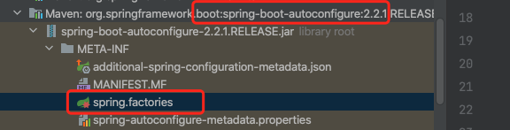

## Springboot

[toc]

Springboot作用：

- 可以快速的创建出Spring应用

- 自动的starter依赖，简化了构建配置

- 自动配置了Spring以及第三方功能

- 内嵌了web服务器（打包成jar包、执行即可）


### 名词解释

#### 微服务

> 微服务是一种架构风格
>
> 一个应用拆分成一组小型的服务
>
> 每个服务运行在自己的进程中，可以独立部署和升级
>
> 服务之间使用轻量级HTTP交互
>
> 服务围绕业务功能进行拆分
>
> 去中心化，服务自治。服务可以使用不同的语言、不通的存储技术

#### 分布式

> 远程调用：http调用
>
> 服务的发现：
>
> 负载均衡：
>
> 服务容错：
>
> 配置管理：配置中心化
>
> 链路追踪
>
> 日志管理

#### 分布式解决

Springboot+SpringCloud


### Springboot的特点

#### 依赖管理

Springboot依赖管理

设置了maven的父工程为spring-boot-starter-parent

```xml
父工程
<parent>
        <groupId>org.springframework.boot</groupId>
        <artifactId>spring-boot-starter-parent</artifactId>
        <version>2.2.1.RELEASE</version>
        <relativePath/> <!-- lookup parent from repository -->
</parent>
父工程的父工程
<parent>
    <groupId>org.springframework.boot</groupId>
    <artifactId>spring-boot-dependencies</artifactId>
    <version>2.2.1.RELEASE</version>
    <relativePath>../../spring-boot-dependencies</relativePath>
</parent>

几乎把所有的开发中常用的依赖的版本号都声明好。
实际开发中只需要引入依赖即可。
```

- 开发倒入Starter场景启动器
- 无需关注版本号，由父工程进行管理
- 可以自定义修改版本号，在实际项目中修改key的值即可

##### spring-boot-start-*

> starters代表着某个开发场景的启动器
>
> 只要引入starter，这个场景的所有常规需要的依赖我们都会自动引用（web-aop-jdbc等）
>
> 所有场景启动器的最底层依赖都是spring-boot-starter

#### 自动配置

- 自动配置Tomcat

- 自动配置好Web常见功能，字符编码问题、SpringMvc

- 默认的包扫描结构

  > 只要是主程序所在的包以及子包都被默认的扫描

  ```java
  @SpringBootApplication等同于
  
  @SpringBootConfiguration
  @EnableAutoConfiguration
  @ComponentScan()
  ```

- 各种配置拥有默认值

  - 默认配置的值，最终都是映射到*Properties

  ```javaj a
  @ConfigurationProperties(prefix = "spring.datasource")
  ```

  - 配置文件的值最终会绑定到每个类上，这个类会在容器中创建对象

- 按需加载所有自动配置项

  - 只有引入了对应的starter才会启动
  - springboot的自动配置功能都在spring-boot-autoconfigure包里面

### 组件功能

#### @Configuration && @Bean

> 告诉springboot这是一个配置类
>
> 1、配置类中使用@Bean注解可以给容器注入组件，代理了xml配置，默认是单例
>
> 2、配置类本身也是组件
>
> 3、proxyBeanMethods：默认为true，每次检查组件是否在容器中存在，
>
> （用于解决配置类中组件注册方法调用是否获取新的对象）

```java
@Configuration
public class ShiroConfig {
    //shiroFilterFactoryBean：3
    @Bean
    public ShiroFilterFactoryBean getShiroFilterFactoryBean(@Qualifier("getDefaultWebSecurityManager") DefaultWebSecurityManager defaultWebSecurityManager){
        ShiroFilterFactoryBean bean=new ShiroFilterFactoryBean();
        return bean;
    }
}
```

之前的@compoment、@controller @server还是可以生效的

#### @Import

> 编写于组件类上
>
> 参数是数组形式，可以批量导入大量的组件

#### @Conditional

> 条件装配：满足contionditional指定条件，则进行组件的注入

#### @ImportResource

> 导入资源，即xml配置文件的内容解析组件，然后注入到容器中。

#### @ConfigurationProperties

> 用于读取配置文件中的属性 application.properties，注入到组件中
>
> - prefix: 前缀

使用的组合：

```java
@Compoment
@ConfigurationProperties

@Configuration //必须是配置类
@EnableConfigurationProperties(xxx.class) //开启xxx.class属性配置功能。并且注入xxx.class
```


### 自动配置原理


> ```javaj a
> @SpringBootApplication
> 
> 
> @SpringBootConfiguration  //代表当前是个配置类
> @EnableAutoConfiguration  //
> @ComponentScan(excludeFilters = { @Filter(type = FilterType.CUSTOM, classes = TypeExcludeFilter.class),
>       @Filter(type = FilterType.CUSTOM, classes = AutoConfigurationExcludeFilter.class) })
>       public class CommunityApplication {
>       
>       }
> ```

- **@SpringBootApplication**

  - **@SpringBootConfiguration**  //代表当前是个配置类

  - **@EnableAutoConfiguration**  

    - **@AutoConfigurationPackage**

      - **@Import(AutoConfigurationPackages.Registrar.class)**

        - **AutoConfigurationPackages.Registrar.class**

          > 给容器中导入一系列的组件，将mainApplication所在包下的所有组件导入进来

    - **@Import(AutoConfigurationImportSelector.class)**

      1、利用getAutoConfigurationEntry(autoConfigurationMetadata,
            annotationMetadata);给容器导入部分组件

      2、调用List<String> configurations = getCandidateConfigurations(annotationMetadata, attributes);获取所有的需要倒入的autoConfigure组件

      3、List<String> configurations SpringFactoriesLoader.loadFactoryNames(getSpringFactoriesLoaderFactoryClass(),
            getBeanClassLoader()); 利用工厂加载器

      4、从META-INF/spring.factories位置的加载一个文件。

      ​    默认扫描当前系统喜爱所有的META-INF/spring.factories位置的文件

      

      ```XML
      # Auto Configure
      org.springframework.boot.autoconfigure.EnableAutoConfiguration=\
      org.springframework.boot.autoconfigure.admin.SpringApplicationAdminJmxAutoConfiguration,\
      org.springframework.boot.autoconfigure.aop.AopAutoConfiguration,\
      org.springframework.boot.autoconfigure.amqp.RabbitAutoConfiguration,\
      org.springframework.boot.autoconfigure.batch.BatchAutoConfiguration,\
      org.springframework.boot.autoconfigure.cache.CacheAutoConfiguration,\
      ....
      ```

      autoconfigure的spring.factiries配置文件中写死了容器所要加载的配置类	

      然后每个AutoConfiguration都有自己的判断以及配置属性

  - **@ComponentScan(excludeFilters = { @Filter(type = FilterType.CUSTOM, classes = TypeExcludeFilter.class)**


#### 自动配置的流程

（1）**@EnableAutoConfiguration**  由多个注解组成

（2）**@Import(AutoConf igurationImportSelector.class)**会每个依赖包从META-INF/spring.factories位置的加载spring.factories文件。

（3）然后springboot-autoconfigure中的spring.factories配置了一大堆容器所要加载的配置类	XXXAutoConfiguration

（4）XXXAutoConfiguration就是每个组件注入的配置类了 


### RestFul风格

> url资源用名词表示，使用HTTP请求方式动词来表示对于资源的操作。

@RequestMapping(value ="/user",method=RequestMethod.GET)

核心filter：HiddenHttpMethodFIlter

- 用法：表单method=post 隐藏域_method=put

Rest的原理：

- 表单提交会带上 _method=PUT
- 请求过来会被HiddenHttpMethodFIlter拦截
  - 请求是否正常，并且是POST
    - 获取到_method的值
    - 兼容一下请求PUT_DELETE_PATCH
    - 原生request（post），包装成了新的requestWrapper的getMethod方法，返回的是传入值
    - 过滤器链放行的时候使用wrapper，以后调用getMethod方法还是调用RequestWrapper

### 请求映射原理

（1）遍历SpringMVC中的RequestMappingHandler 

 （2）找出符合路径的的handlerMapping

（3）解析参数HandlerMethodArgumentResolver

（3）执行对应的方法

### 数据相应与内容协商

- 相应json

  > @ResponseBody

### 拦截器

#### HandlerInterceptor

- preHandle()
- postHandle()
- afterHandle()


### Error Handing 异常处理器

### Profile功能


